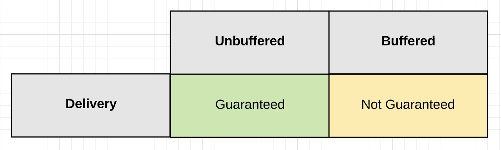

# Chapter 4 - Concurrency

## [Concurrency is not parallelism](http://www.youtube.com/embed/cN_DpYBzKso)

**Concurrency is about dealing with lots of things at once.**

**Parallelism is about doing lots of things at once.**

## Green threads

In computer programming, green threads are threads that are scheduled by a runtime library or virtual machine (VM) instead of natively by the underlying operating system. Green threads emulate multi-threaded environments without relying on any native OS capabilities, and they are managed in user space instead of kernel space, enabling them to work in environments that do not have native thread support ([wiki](https://en.wikipedia.org/wiki/Green_threads)).

Some example languages are:

- .NET Framework's [TPL](https://docs.microsoft.com/en-us/dotnet/standard/parallel-programming/task-based-asynchronous-programming)
- Erlang (Processes, Actors)
- Haskell's coroutines
- Go's goroutines

## Goroutines

- no thread pool
- small stack compared to other implementations (4kB instead of 1-8MB) which makes them cheap to create
- if a goroutine blocks (network, sleeping, channels, sync...) another will be scheduled instead

```go
go func(a int){
    ...
}(1)
```

## Channels

Inspired from Hoare's Communicating Sequential Processes, or CSP.

Channels are the pipes that connect concurrent goroutines.
You can send values into channels from one goroutine and receive those values into another goroutine.

- unbuffered

```go
ch := make(chan string)
```

- buffered

```go
ch := make(chan string, 10)
```

Both block eventually if no consumer is hooked.

When using channels as arguments in function and methods we can specify if we:

- receive data only

```go
func test(ch <-chan string)
```

- send data only

```go
func test(ch chan<- string)
```

- both

```go
func test(ch chan string)
```

The code is checked compile time!

Channels are about signaling!

### Channel State

- nil

```go
var ch chan string
or
ch = nil
```

- open

```go
ch := make(chan string)
```

- close

```go
close(ch)
```


### Guarantee Of Delivery



### Signaling With Data


- Guarantee

    An unbuffered channel gives you a guarantee that a signal being sent has been received,
    because the receive of the signal happens before the send of the signal completes.

- No Guarantee

    A buffered channel of size >1 gives you No guarantee that a signal being sent has been received,
    because the send of the signal happens before the receive of the signal completes.

- Delayed Guarantee

    A buffered channel of size =1 gives you a delayed guarantee.
    It can guarantee that the previous signal that was sent has been received,
    because the receive of the first signal, happens before the send of the second signal completes.

### Signaling Without Data


### Send

- send with data

```go
ch := make(chan string)
ch <- "test"
```

### Send without data

```go
ch := make(chan struct{})
ch <- struct{}{}
```

Hint: **It is the zero-space, idiomatic way to indicate a channel used only for signalling**

### Receive

```go
ch := make(chan int)
close(ch)
val, ok := <-ch
fmt.Printf("val: %d ok: %t\n", val, ok)
```

ok is false if the channel is closed and val's value is the default for the type

- for range loop

```go
for val := range ch {
    fmt.Print(val)
}
```

for exits if the channel is closed

- select (multiple channels)

```go
select {
    case <-ctx.Done():
    ...
    case val, ok := <-ch:
    ...
}
```

ok is false if the channel is closed

- deadlock

```go
ch := make(chan int)
val, ok := <-ch
fmt.Printf("val: %d ok: %t\n", val, ok)
```

### Examples

- Send data to goroutine, wait for goroutine to complete (channel3.go)

```go
ch := make(chan string)

go func() {
    fmt.Print(<-ch)
    close(ch)
}()

ch <- "Hello"
<-ch
fmt.Print(", World!\n")
```

- Loop and close (channel4.go)

```go
ch := make(chan string, 4)
chSig := make(chan struct{})

go func() {
    for val := range ch {
        fmt.Print(val)
    }
    chSig <- struct{}{}
}()

for i := 1; i < 4; i++ {
    ch <- fmt.Sprintf("%d,", i)
}
close(ch)
<-chSig
fmt.Print(" Boom!\n")
```

## Context package

Package context defines the Context type, which carries deadlines, cancellation signals, and other request-scoped values across API boundaries and between processes.

Context can form a tree of contexts every time we use one of the next functions.

- WithCancel(parent Context) (ctx Context, cancel CancelFunc)

```go
childCtx, cnl := context.WithCancel(ctx)
...
cnl()
```

- WithDeadline(parent Context, d time.Time) (Context, CancelFunc)

```go
childCtx, cnl := context.WithDeadline(ctx, d)

...

cnl() // or the deadline passed
```

- WithTimeout(parent Context, timeout time.Duration)

```go
childCtx, cnl := context.WithTimeout(ctx, 1 * time.Second)

...

cnl() // or timeout passed
```

- func WithValue(parent Context, key, val interface{}) Context

Use context Values only for request-scoped data that transits processes and APIs, not for passing optional parameters to functions.

```go
type favContextKey string

f := func(ctx context.Context, k favContextKey) {
    if v := ctx.Value(k); v != nil {
        fmt.Println("found value:", v)
        return
    }
    fmt.Println("key not found:", k)
}

k := favContextKey("language")
ctx := context.WithValue(context.Background(), k, "Go")

f(ctx, k)
f(ctx, favContextKey("color"))
```

Which prints out:

```bash
found value: Go
key not found: color
```

**The convention is that every function or method that need to use or propagate context has it as its first argument:**

```go
func test(ctx context.Context, name string)
```

### Cancel a worker example

- Setup

```go
chDone := make(chan struct{})
ch := make(chan int, 1000)
ctx, cnl := context.WithCancel(context.Background())
```

- Producer

```go
go func() {
    i := 0
    for {
        if ctx.Err() != nil {
            fmt.Print("Producer Done\n")
            chDone <- struct{}{}
            return
        }
        ch <- i
        i++
        time.Sleep(100 * time.Millisecond)
    }
}()
```

- Consumer

```go
go func() {
    for {
        select {
        case <-ctx.Done():
            fmt.Print("Writer Done\n")
            chDone <- struct{}{}
            return
        case n := <-ch:
            fmt.Printf("%d\n", n)
        }
    }
}()
```

- Sync

```go
time.Sleep(10 * time.Second)
cnl()
<-chDone
<-chDone
```

Take a look at the [full example.](src/context/main.go)

## Sync package

Package sync provides basic synchronization primitives such as mutual exclusion locks.
Other than the Once and WaitGroup types, most are intended for use by low-level library routines.
Higher-level synchronization is better done via channels and communication.

### [WaitGroup](src/sync1/main.go)

A WaitGroup waits for a collection of goroutines to finish.
The main goroutine calls Add to set the number of goroutines to wait for.
Then each of the goroutines runs and calls Done when finished.
At the same time, Wait can be used to block until all goroutines have finished.

```go
wg := sync.WaitGroup{}
for i := 0; i < 5; i++ {
    wg.Add(1)
    go func(i int) {
        defer wg.Done()
        fmt.Printf("%d\n", i)
        time.Sleep(1 * time.Second)
    }(i)
}
wg.Wait()
```

- Mutex

Mutual exclusion lock.
Channels internally work with mutexes.

```go
type sum struct {
    sync.Mutex
    sum int
}

func (s *sum) add(i int) {
    s.Lock()
    defer s.Unlock()
    s.sum = s.sum + 1
}

func main() {
    wg := sync.WaitGroup{}
    s := sum{}
    for i := 0; i < 5; i++ {
        wg.Add(1)
        go func(i int) {
            defer wg.Done()
            s.add(i)
        }(i)
    }
    wg.Wait()
    fmt.Printf("Sum: %d\n", s.sum)
}
```

Check out the [full example](src/sync2/main.go).

- RWMutex

Same as Mutex. Readers don't block each other but one writer blocks all (readers and writers).

## Concurrency patterns

### Pipeline

Setting up a 3 stage pipeline

- generate numbers

```go
func gen(ch chan<- int) {
    for i := 1; i <= 10; i++ {
        ch <- i
    }
    close(ch)
}
```

- square numbers

```go
func sq(ch <-chan int, chRes chan<- int) {
    for v := range ch {
        chRes <- v * v
    }
    close(chRes)
}
```

- print numbers (inside the main) (pattern1.go)

```go
numbers := make(chan int, 10)
results := make(chan int, 10)
go gen(numbers)
go sq(numbers, results)

for result := range results {
    fmt.Printf("Result: %d\n", result)
}
```

Take a look at the [full example](src/pattern1/main.go).

### Fan Out/In


- Work distributing

- Distribute work

```go
func distr(ch <-chan int, chRes chan<- int) {
    wg := sync.WaitGroup{}
    for v := range ch {
        wg.Add(1)
        go func(v int) {
            defer wg.Done()
            sq1(v, chRes)
        }(v)
    }
    wg.Wait()
    close(chRes)
}
```

- main (pattern2.go)

```go
numbers := make(chan int, 10)
results := make(chan int, 10)
go gen1(numbers)
go distr(numbers, results)
for result := range results {
    fmt.Printf("Result: %d\n", result)
}
```

Take a look at the [full example](src/pattern2/main.go).

- Work stealing

- spin up workers

```go
func workers(ch <-chan int, chRes chan<- int) {
    wg := sync.WaitGroup{}
    for i := 0; i < 10; i++ {
        wg.Add(1)
        go func() {
            defer wg.Done()
            sq2(ch, chRes)
        }()
    }
    wg.Wait()
    close(chRes)
}
```

- main (pattern3.go)

```go
numbers := make(chan int, 10)
results := make(chan int, 10)
go workers(numbers, results)
go gen2(numbers)
for result := range results {
    fmt.Printf("Result: %d\n", result)
}
```

Take a look at the [full example](src/pattern3/main.go).

## Error handling

- exit application

```go
go func() {
    ...
    if err != nil {
        log.Fatalf("error: %v",err)
    }
}()
```

- using error channel

```go
go func() {
    ...
    if err != nil {
        chErr <- err
    }
}()
```

- using result struct with error

```go
type Result struct {
    Err error
    Amount float
}

go func() {
    ...
    if err != nil {
        chRes <- Result{err:err}
    }
}()
```

[-> Next&nbsp;&nbsp;&nbsp;&nbsp;&nbsp;&nbsp;&nbsp;&nbsp;: **Chapter 5**](../chapter5/README.md)  
[<- Previous&nbsp;: **Chapter 3**](../chapter3/README.md)
